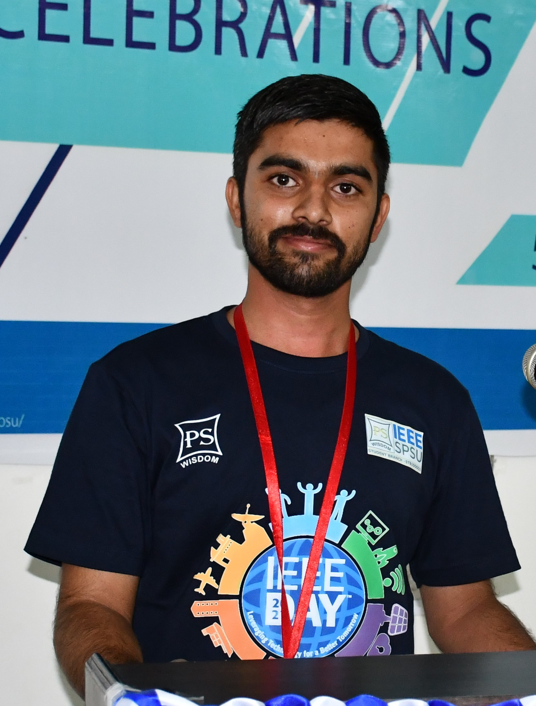

## Who am I?



 <!--  -->

    

 

I'm a fast learner who loves exploring data and turning it into clear stories.
 
 
My goal is to grow as a Data Scientist/Machine Learning Engineer in a stable company where I can contribute with my skills and dedication.
 
 

I'm a hard worker who thrives under pressure, using tools like stats and programming to get results. Plus, I'm great at talking to people to ensure everyone's on the same page.

 

 
 

<!-- Ready to unlock the power of data together? Let's team up! -->
 Let's Connect, I believe You are YouYou, So   YouYou &nbsp; * &nbsp;  MeMe  &nbsp; =   &nbsp; DoImpossible



<!-- ## My Experience
Integer est purus, aliquam ac enim aliquet, viverra sodales mauris. Integer neque sapien, fermentum sit amet augue in, vulputate pellentesque turpis. Quisque eget blandit turpis, in semper lectus. -->
