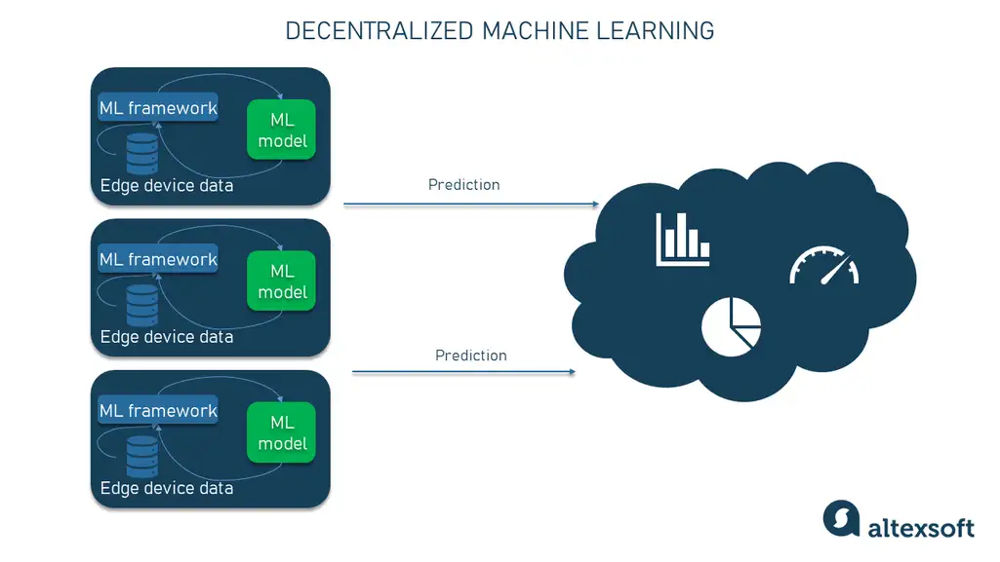

# Intro to FL(Federated Learning)

## The Problem with Current Machine Learning

Data goes to your model.

- Getting data from different sources can change the true nature and authenticity of the data. It also creates worries about sharing and keeping the collected data private.  

- Today's machine learning algorithms have data stored in one central place. This means the authenticity and originality of the data can be altered, and the data can be fake or synthetic.

## The Solution: Federated Learning (FL)

In FL, your model goes to the data.

- In simpler terms, your model is shared and spread across the different data sources, and your model is trained on the data on individual devices or machines. All the updated model weights are then combined into a central model.

- There is a main central model that communicates with other models distributed across many client devices. The client model is trained on the client's system multiple times in rounds so that it can handle different types of data. After addressing data issues, the distributed models share their final weights with the central model.

For example, people from different regions use Google's keyboard, and they get suggestions in their local languages.

Another example we're all familiar with is next-word predictions on our phone keyboards. The suggestions are based on our typing habits.

Another use case is detecting anomalies in industrial IoT devices, as different IoT devices work differently based on their surroundings and characteristics, needing different maintenance predictions from other IoT devices.

## How FL is Effective

There are various methods to use data from different sources and train models, but Federated Learning is a proven and widely used technique. It solves privacy issues and the risk of exposing personal data by not taking data from clients.

- For data generalization, having many different forms of data can reduce the performance of a regular machine-learning model. To avoid this, our model should be able to handle all kinds of data.

- The machine learning model should use less computing power so it doesn't overload client devices and machines.  

- The model should be trained in multiple rounds to train efficiently by handling the different types of data and resource availability on clients' devices.

*[source](https://www.altexsoft.com/blog/federated-learning/)*

Reading Material [link](https://www.altexsoft.com/blog/federated-learning/)
