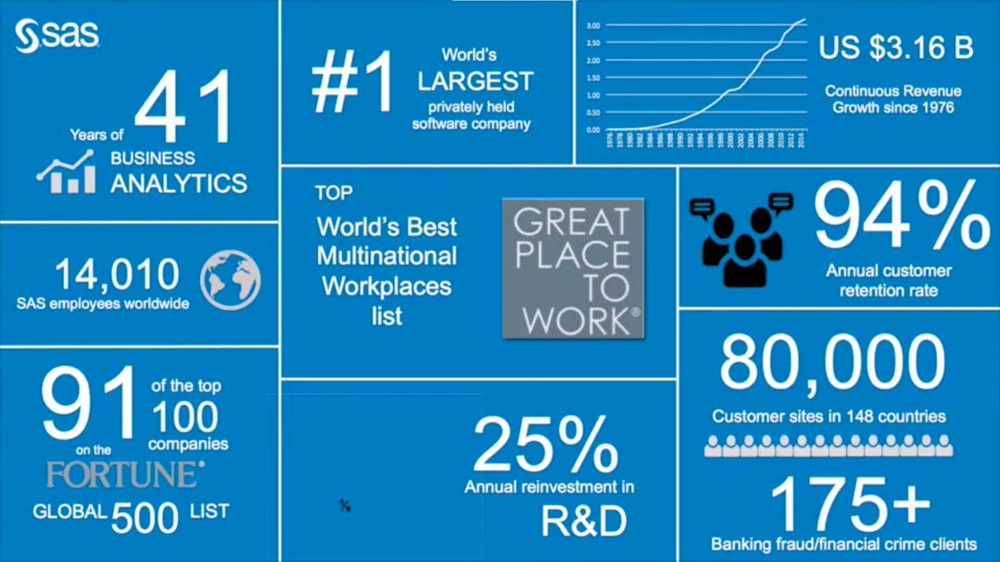

# SAS Fraud Management Platform - All in one solution for Fraud Detection

The issue of fraud has always presented challenges, but in today's digital age, it has grown more complex and sophisticated. Fraudsters are continuously devising new methods to exploit systems and pilfer valuable resources, especially in sectors such as banking, retail, subscription fraud, and credit card fraud. However, technology is pushing back with great force. I recently watched a talk presentation by Varun Mehta, a renowned fraud prevention expert from SAS Middle East, where he shed light on how advanced analytics, artificial intelligence (AI), and machine learning (ML) are revolutionizing the battle against fraud.

In this post, I will guide you through the main ideas of Varun’s speech, explaining how SAS's creative tools are aiding companies worldwide in identifying and stopping fraud with greater efficiency. If you work in finance, healthcare, or any sector susceptible to fraudulent behavior, the information from this talk could be extremely beneficial in fortifying your security measures.

## Introduction to SAS and Their Role in Fraud Detection

SAS is not just like any other software company. They have been leading the way in business analytics for more than 41 years, consistently pushing the boundaries with new technologies. What impressed me the most was their commitment to reinvesting a substantial portion of their revenue - 25%, which is more than twice the industry average - back into research and development. This focus on innovation has allowed SAS to develop strong, long-term partnerships with clients and provide state-of-the-art solutions to address the constantly changing challenges of fraud.
SAS currently supports over 80,000 clients in 148 nations, assisting them in addressing various fraud situations using a flexible and integrated technology platform.

## The SAS Fraud Platform: A Comprehensive Solution

Varun Mehta presented a detailed overview of the SAS Fraud Platform, which is a powerful tool designed to combat various forms and types of fraud in different sectors. This platform is valuable because it eliminates the need for separate systems to address different types of fraud, providing a unified and comprehensive solution.

### Here are some key points

1. *Cross-Industry Application*: The SAS Fraud Platform is capable of detecting fraud across various industries such as banking, insurance, healthcare, e-commerce, and procurement, thanks to its versatile technology.

2. *Real-Time Detection*: Its real-time fraud detection capability is a game-changer as it can swiftly identify and prevent fraudulent activities, safeguarding organizations from significant financial losses.

3. *Advanced Analytics and Machine Learning*: Through advanced analytics and machine learning, the platform can uncover unnoticed fraud by examining extensive data and identifying irregular patterns. This includes identifying suspicious banking transactions and uncovering procurement fraud involving ghost vendors and duplicate invoices.

Recently SAS also did a survey by sending 22 questions to its member all over the world for asking about their organization's anti-fraud initiatives.
Here are the ways you can explore the report, first A visually appeling [dashboard](https://tbub.engage.sas.com/SASVisualAnalytics/?reportUri=%2Freports%2Freports%2Fdd662d82-6890-4f17-9cfe-43251c355543&sso_guest=true&printEnabled=false&shareEnabled=false&informationEnabled=false&commentsEnabled=false&alertsEnabled=false&reportViewOnly=true&reportContextBar=false&sas-welcome=false) and second complete report with a login [report](https://www.sas.com/en_us/offers/24q1/anti-fraud-technology.html).

here is a screen shot of showing the uses of analytics tools in banking and finance services for fraud detection

## Real-World Examples of Fraud Detection

Varun shared several real-world examples that highlight the effectiveness of the SAS Fraud Platform.

### Example 1

In a situation in which malicious individuals took advantage of an unused bank account and changed their account address and phone no. to illegally transfer large amounts of money in small increments, the standard monitoring systems did not detect fraudulent activity until after it had already occurred. The perpetrators efficiently carried out their plan over a short period of about 30 minutes, using various mule accounts to withdraw the unlawfully obtained funds and bypass standard surveillance methods.

If the organization had incorporated SAS Fraud Protection into its system, the platform would have quickly caught the abnormal activity by identifying key signs, such as sudden changes in account information followed immediately by high-value transactions. These irregularities would have triggered real-time alerts within the first 5 minutes, enabling proactive detection and allowing the organization to promptly halt all account activities before the fraudulent individuals could carry out their plan.

### Example 2

Another example is a company with 8,000 employees. During an audit, it was discovered that 140 people were over the age of 80, even though the official government retirement age is 63. It was found that salaries for these individuals were still being paid after they retired. What happened is that when a person retired or left the company, the payroll department did not stop the payments but instead changed the account details to their controlling account. This is a form of fraud where people's money is taken unlawfully.

The examples emphasize the growing challenges of fraud in today's digital age and highlight the pivotal role of advanced analytics, artificial intelligence, and machine learning in combatting fraudulent activities. It stresses the importance of implementing advanced technological solutions to protect against and prevent fraudulent behavior in various sectors.

## Reference

- [SFM](https://www.sas.com/en_in/software/fraud-management.html)
- [Video](https://youtu.be/39iaStcVVUo?si=wb6nSq4pwwUEGeoX)
- [Report](https://www.sas.com/en_us/offers/24q1/anti-fraud-technology.html)
- [Dashboard](https://tbub.engage.sas.com/SASVisualAnalytics/?reportUri=%2Freports%2Freports%2Fdd662d82-6890-4f17-9cfe-43251c355543&sso_guest=true&printEnabled=false&shareEnabled=false&informationEnabled=false&commentsEnabled=false&alertsEnabled=false&reportViewOnly=true&reportContextBar=false&sas-welcome=false)
- [Insights from the 2024 Anti-Fraud Technology Benchmarking Report - ACFE Blog](https://www.acfe.com/acfe-insights-blog/blog-detail?s=insights-from-2024-anti-fraud-technology-benchmarking-report)
