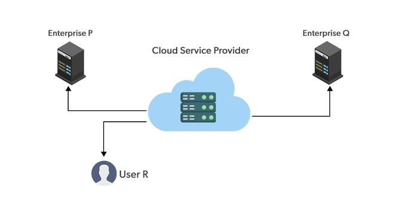
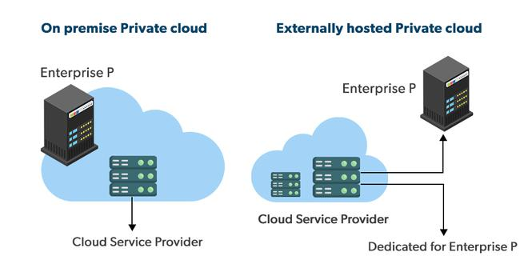
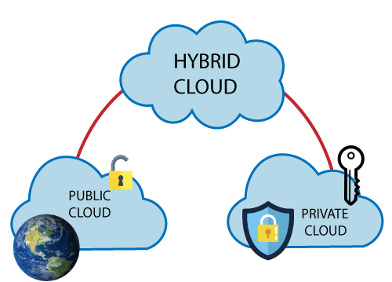

# Cloud Computing

1. Types of cloud/ Cloud deployment model

## Public Cloud





<!-- + *[IMAGE](https://media.geeksforgeeks.org/wp-content/uploads/20211123123729/Group4-660x330.jpg) -->

- Public cloud managed by third parties which provide cloud service over the enternet to the pubilc
- public cloud is the go-to option for the small enterprise, where they are able to start there businesse without large upfront investment.
- multitenacy :--> meant to serve multiple user not a singel user

## Private Cloud





 <!-- *[IMAGE](https://media.geeksforgeeks.org/wp-content/uploads/20211123123851/Group1-660x330.jpg)* -->

- aka coprate cloud or internal cloud
- used by the organization to built and manage there own data centers internally or by the third party.
- private cloud distrubuted system that work on private infrastructure and provide the user with dynaminacally provisioning of computing resource
- Advantages
- better performance, improved speed, space complexity
- suitable for the organization that requires a separate cloud for there personal use and data security is the first priority.
- Coustomer information protection
- Infrastureture ensuring SLA
- Complience with standard procedures and operations

## Hybrid Cloud





 <!-- <!- *[IMAGE](https://static.javatpoint.com/cloudpages/images/hybridcloud.png)* --> -->

- it is a combination of public and private cloud
- Hybrid cloud is partially secure because the services which are running the public cloud can be access by anyone and service running by private cloud can be access by the organization user's.
- Example : Google application gmail, gdrive, office 365
