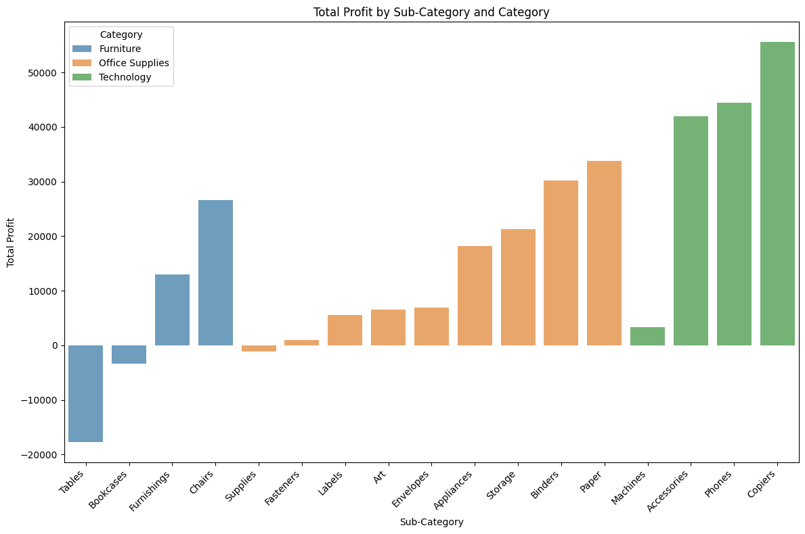
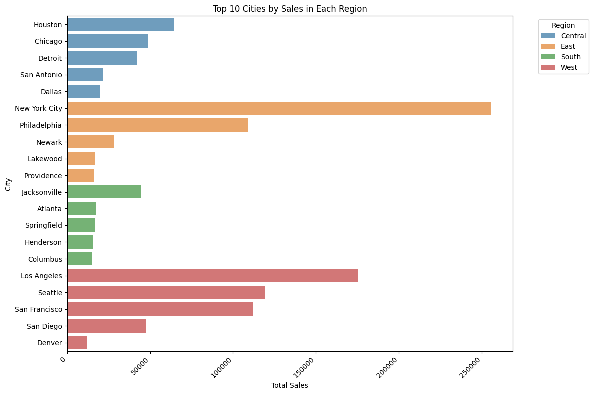
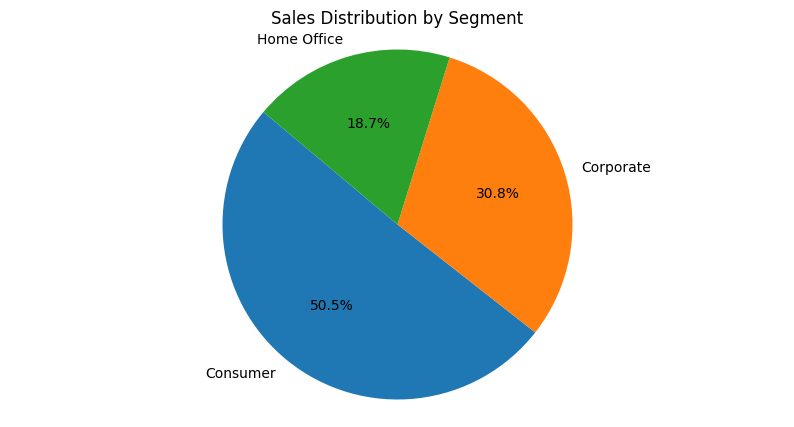
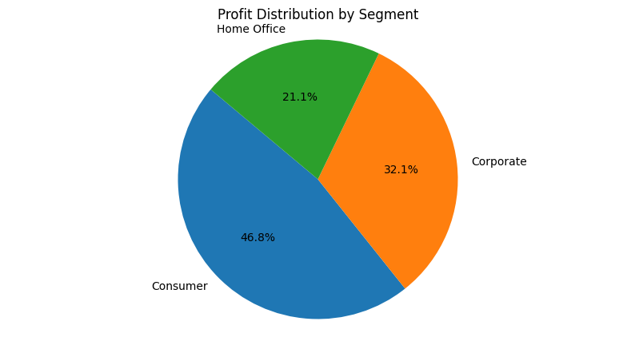

# Retail-Data-Analysis

## Problem Statement
In today's tough business world, companies need useful insights to grow and make money. But without data analysis, making decisions can be hard. This project aims to look at sales and profit data to find trends and chances for improvement. Using these insights, businesses can improve strategies and lead the market.

## Project Description

- Identify the region and city with the highest sales. [Link](#sales-with-region-and-city)
- Ship Mode's Impact on Profitability and Sales. [Link](#ship-mode)
- Analyze the category and subcategory with the highest profit. [Link](#profit-and-category-sub-category)
- Identify the segment with the highest profit and sales. [Link](profit-and-segment)

## Images

  <iframe id="inlineFrameExample"
      title="Analysis Notebook"
      width="100%"
      height="100%"
      src="https://ukant.tech/Retail-Data-Analysis/">
  </iframe>

