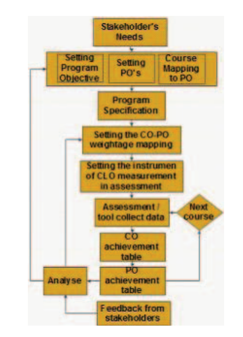

**This was a team project.**

The aim of this project is to provide the university with a web portal for the implementation of Outcome-Based Education (OBE).

OBE can primarily be distinguished from traditional education methods by the way it incorporates three elements: a theory of education, a systematic structure for education, and a specific approach to instructional practice. It organizes the entire educational system towards what is considered essential for learners to successfully achieve at the end of their learning experiences. In this model, the term 'outcome' is the core concept and is sometimes used interchangeably with the terms 'competency,' 'standards,' 'benchmarks,' and 'attainment targets.' OBE also utilizes the same methodology formally and informally adopted in the actual workplace to achieve outcomes.

The web portal is built with the Laravel framework of PHP for the front end and utilizes MySQL for the database.

My Role: My role is to build the business logic, conduct literature reviews, generate reports, and suggest the next steps based on those reports. I also assist in building the database

