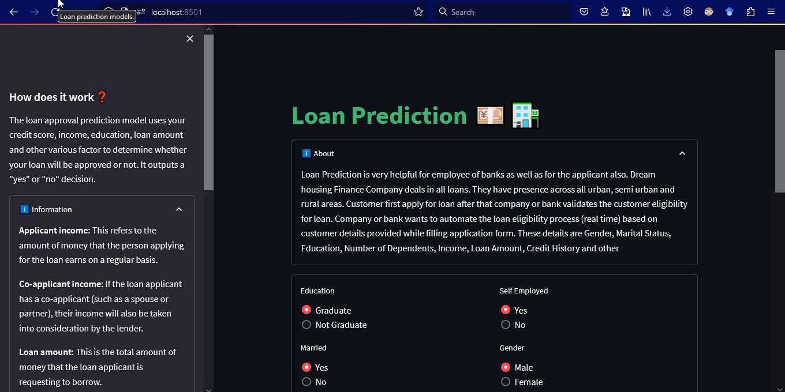
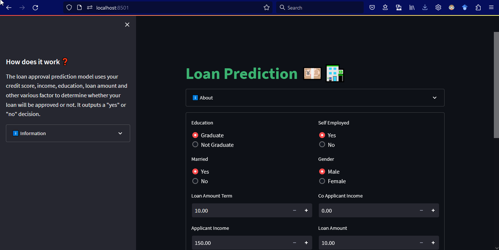
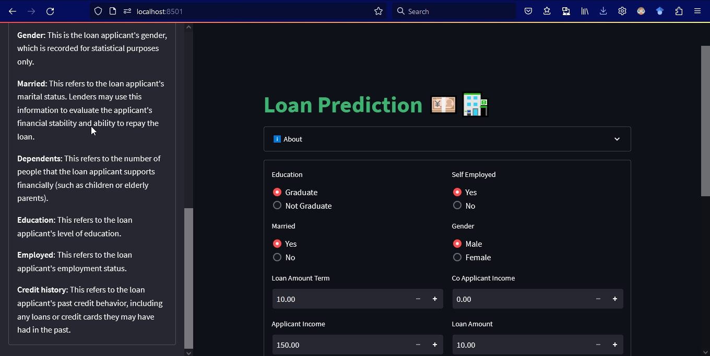

<!--  -->
This model is trained on a loan dataset with parameters like monthly income, gender, marital status, self-employment status, property area, etc. This model uses all the real-life factors and parameters to detect whether a loan should be given to a person or not. It helps banking or loan departments make an informed decision.

In this project, the models used for classification are logistic regression, K-nearest neighbors classifier, support vector machine, and decision tree classifier.

In this project, the following steps were taken: data collection, data preprocessing, data splitting, model implementation, and model evaluation. A detailed description of each step is given below:

1. Data Collection: I collected the data from Kaggle and read it with the `pandas` library. I analyzed the data frame using `df.info()` and `df.describe()`.
1. Data Preprocessing: For preprocessing, I dropped the duplicate values and removed and filled the null values with their respective methods, like using the median for numerical data and the mode for objective data. For visualization, I drew some plots like line plots, countplots, and bar plots for counting the loan status employment status, and other attributes to get a brief understanding of the dataset. I also generated the categorical and numerical data separately for further splitting.
1. Data Splitting: In this state, I divided the data into 80% for training and 20% for testing.
1. Model Implementation: I created a dictionary where the keys are the model names, and the values are the model instances themselves with parameters. I applied functions like loss calculation and model evaluation to this dictionary.
Output: Finally, I saved the data in a suitable format using pandas.

