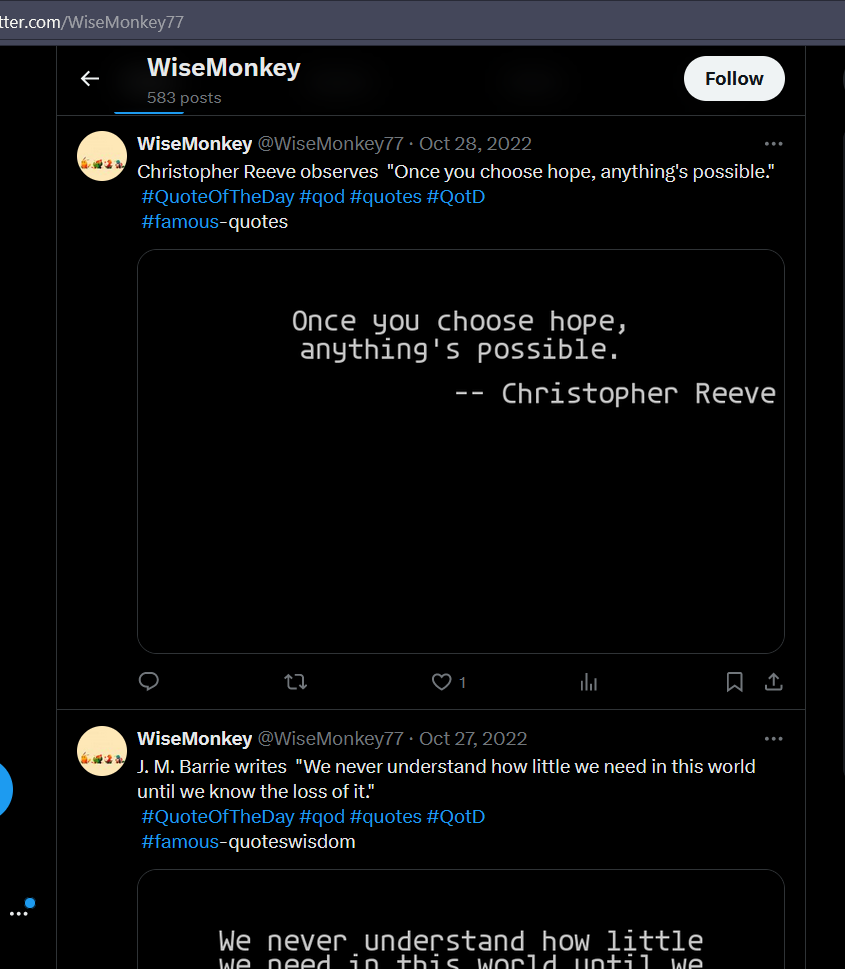
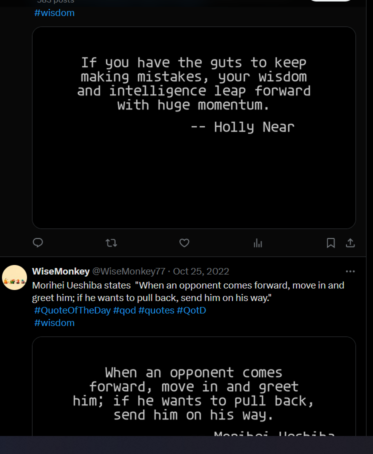

This was an X(Twitter) bot that posted images containing a quote taken from the best quote REST API, every 24 hours, using cron jobs. I utilize the pillow library for adding quotes on the image. It generates images tweets them and also adds them to the local database

The automated posting is done due to the cron jobs in the Linux OS.

