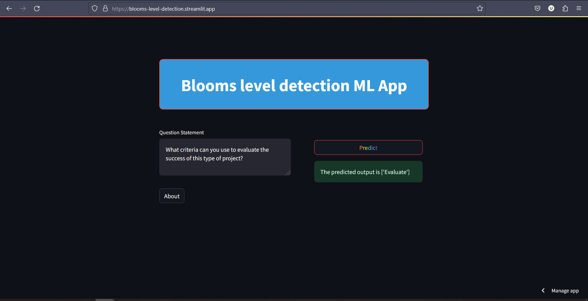

This project aims to classify the given statement into accurate Bloom's taxonomy levels out of six levels. This is an NLP-based project. This project is built with TF-IDF vectorizer and multinomial Naive Bayes techniques. 

The model is trained on 1800 augmented statements. Initially, I had 100 statements for each class, so a total of 600 statements for six classes. Then, this data is augmented three times using contextual word embedding augmentation, and the model used in the augmentation is BERT-based. An example of the augmentation methodology is inserted below

augmented each Text input 3 times with the following parameter with `nlpaug` library
```python
ContextualWordEmbsAug(model_path="bert-base-uncased", action="insert")
```

> before augmendatation data shape : 600,2                                  
> total 6 unique calsses 100 each                                   
> augmented data shape : 1800,2                                  
> total 6 unique classes 300 each                                  

This project follows MLOps techniques well. I have divided this project into 6 different pipelines for easy implementation and scalability. I created a class in the pipeline for each class using different entities and components. In generating a configuration file from the user input in the YAML format. 

In the end, I created a Docker image so it can be used by the Higher Education Institute(HEIs) for those who are using the OBE(Object Based Education) new curriculum technique. It just reduced the manual process of identifying each question and its root taxonomy level.



