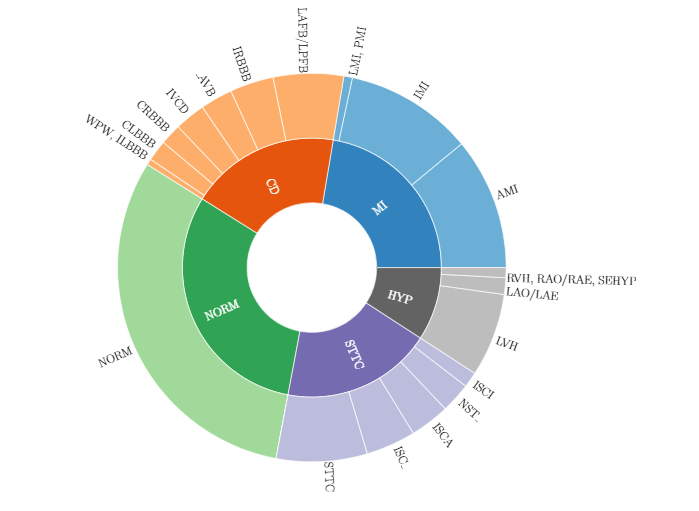
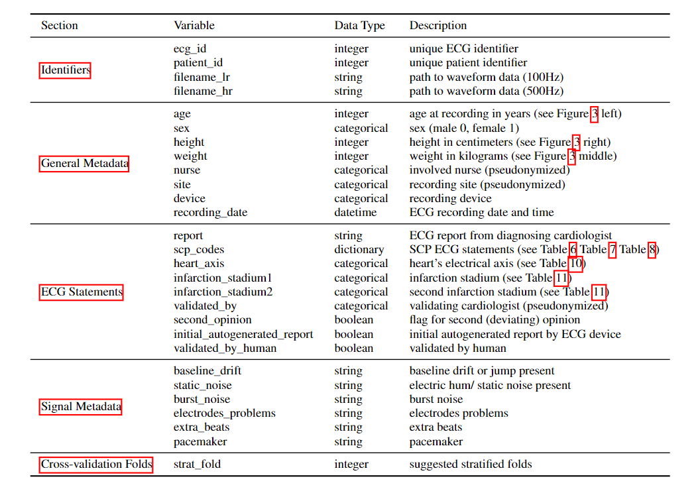
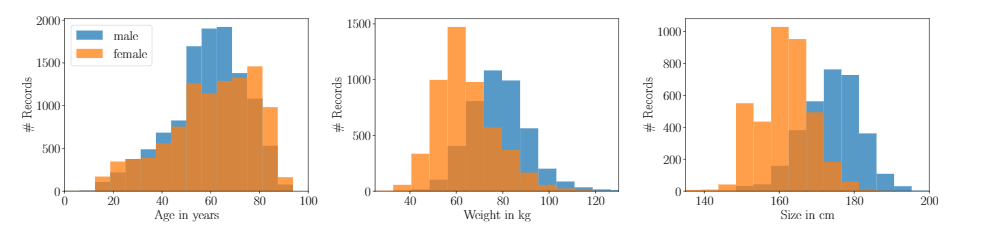

Classification of 5 major types of disease/disorder from ECG dataset of PTB-XL ECG dataset(21K+ sample from 18K+ patients). the dataset for this project is taken from the official website of [physionet.org](https://physionet.org/content/ptb-xl/1.0.3/) and the name of the dataset is **PTB-XL**, a large publicly available electrocardiography dataset**.

The aim is to provide insights into the effectiveness of traditional and modern algorithms in ECG-based heart disease classification, with the potential to contribute to the improvement of diagnostic tools in the healthcare industry.

Traditional algorithms such as Support Vector Machines, Decision Trees, and Logistic Regression, alongside advanced methodologies such as Multi-Layer Perceptron and Convolutional Neural Networks.

The scope of the project includes:

- Exploring PTB-XL dataset Published: Nov. 9, 2022. Version: 1.0.3
- Preprocessing the ECG data `wfdb` and other libraries.
- Implementing traditional algorithms and advanced algorithm
- Analyzing the performance of each algorithm in terms of AUC, accuracy, precision, recall, and F1-score.
- Comparing the results to understand the strengths and weaknesses of each algorithm in classifying heart disease from the ECG dataset.

#### Images

- The dataset comprises 21837 clinical 12-lead ECG records of 10 seconds in length from 18885 patients.
For the diagnostic labels, it provides a hierarchical organization in terms of 5 coarse superclasses and 24 sub-classes for the diagnostic labels

- Columns provided in the metadata table ptbxl_database.csv. Each ECG is identified by a unique ID (ecg_id) and comes with several ECG statements (scp_codes) that can be used to train a multi-label classifier that can be evaluated based on the proposed fold assignments (strat_fold).

- Demographic overview of patients in PTB-XL.

